= Red Hat Advanced Cluster Management for Kubernetes - RHACM
:toc:

== Goal of the Workshop

In this session, participants will learn how to work with Red Hat Advanced Cluster Management for Kubernetes (RHACM) 

Participants will walk through these 3 major use cases:

** Multi-Cluster Lifecycle
  *** Centrally manage, create update and delete Kubernetes clusters.
  *** Search, find and modify any kubernetes resource across the entire domain.
  *** Quickly troubleshoot and resolve issues across your federated domain.

** Advanced Application Lifecycle
  *** Easily deploy applications at scale leveraging GitOps.
  *** See applications work real time from multiple sources.
  *** Quickly visualize application relationships across clusters and those that span clusters.

** Policy Driven Governance
  *** Centrally set and enforce policies for security, applications, and infrastructure.
  *** Quickly visualize detailed auditing on configuration of apps and clusters.
  *** Leverage Policy Generator to generate policies at scale.

** Observability
 *** View metrics on your manged clusters
 *** Create alerts for your metrics
 *** Create custom Grafana dashboards


Let's get started! 

== Working with Kubernetes Clusters and Cluster Lifecycle

At a high level Cluster Lifecycle management is about creating, upgrading, destroying, and importing clusters in a multi-cloud environment, whether that might be OpenShift Hosted Control Plane Cluster - HCP, a Single Node Cluster - SNO, or a Normal OpenShift cluster.

In the demo console where you have all the credentials, you will find the *OCP Console URL, Username and Password, AWS credentials*, *Access Key ID*, *Secret Access Key*, and the *Base DNS Domain*.

** To get started, switch over to the *OpenShift Console* 
** Use your login credentials (*kubeadmin* / *YOUR_PASSWORD*) from the https://demo.redhat.com/workshop/qmukdd[demo console]

Once you have logged in to the OpenShift Console, navigate to the *Cluster drop down menu* and then select *All Clusters*. This will bring you to the RHACM interface.

image::images/acm-allclusters.png[]

In this interface you will see two clusters available, the first cluster is a Hosted Control Plane Cluster called *development* 

You will also find a second cluster called *local-cluster*. This cluster is where the Advanced Cluster Management For Kubernetes Operator resides.

image::images/acm-hcp-cluster.png[]

---

=== Hosted Control Planes Background

Hosted Control Planes - Project Name HyperShift - is a form factor of Red Hat OpenShift Container platform, but it follows a distinct architectural model.

In standalone OpenShift, the control plane and data plane are coupled in terms of locality. A dedicated group of nodes hosts the control plane with a minimum number to ensure a quorum and the network stack is shared; while functional, this approach may not always meet customers' diverse use cases, especially when it comes to multi-cluster scale deployments.

To address this, Red Hat provides hosted control planes in addition to standalone OpenShift. Hosted Control Planes are based on the upstream Red Hat project HyperShift which can be thought of as a middleware for hosting OpenShift control planes at a scale. HyperShift solves for cost and time to provision, as well as a strong separation of concerns between management and workloads.

Hosted control planes for Red Hat OpenShift decouple the control plane from the data plane:

* It provides network domain separation between control-plane and workloads.
* Offers a shared interface for fleet administrators and Site Reliability Engineers (SREs) to operate multiple clusters easily.
* Treats the control plane like any other workload, enabling administrators to use the same stack to monitor, secure, and operate their applications while managing the control plane.

The decoupling of the Control Plane and DP introduced multiple potential benefits and paves the way for a Hybrid-cloud approach. Below are possibilities that Hosted Control Plane as a technology enables:

* *Trust Segmentation & Human Error Reduction*: Management plane for control planes and cloud credentials separate from the end-user cluster. A separate network of management from the workload. Furthermore, with the control-plane managed, it is harder for users to basically shoot themselves in the foot and destroy their own clusters since they won’t be seeing the CP resources in the first place.
* *Cheaper Control Planes*: You can host ~7-21 control planes into the same three machines you were using for 1 control plane. And run ~1000 control planes on 150 nodes. Thus you run most densely on existing hardware. Which also makes HA clusters cheaper.
* *Immediate Clusters*: Since the control plane consists of pods being launched on OpenShift, you are not waiting for machines to provision.
* *Kubernetes Managing Kubernetes*: Having control-plane as Kubernetes workloads immediately unlocks for free all the features of Kubernetes such as HPA/VPA, cheap HA in the form of replicas, control-plane Hibernation now that control-plane is represented as deployments, pods, ... etc.
* *Infra Component Isolation*: Registries, HAProxy, Cluster Monitoring, Storage Nodes, and other infra type components are allowed to be pushed out to the tenant’s cloud provider account isolating their usage of those to just themselves
* *Increased Life Cycle Options*: You can upgrade the consolidated control planes out of cycle from the segmented worker nodes, including embargoed CVEs.
* *Future Mixed Management & Workers IaaS*: Although it is not in the solution today, we feel we could  get to running the control plane on a different IaaS provider than the workers faster under this architecture
* *Heterogeneous Arch Clusters*: We can more easily run control planes on one CPU chip type (ie x86) and the workers on a different one (ie ARM or even Power/Z).
* *Easier Multi-Cluster Management*: More centralized multi-cluster management which results in fewer external factors influencing the cluster status and consistency
* *Cross Cluster Delivery Benefits*: As we look to have more and more layered offerings such as service mesh, server-less, pipelines, and other span multiple clusters, having a concept of externalized control planes may make delivering such solutions easier.
* *Easy Operability*: Think about SREs. Instead of chasing down cluster control-planes, they would now have a central-pane of glass where they could debug and navigate their way even to cluster data-plane. Centralized operations, less Time To Resolution (TTR), and higher productivity become low-hanging fruits.

---

=== Importing a new cluster into ACM

We already have two clusters being manged in ACM, but let's add a third using the other cluster provided to you https://demo.redhat.com/workshop/es4fqq[here]. Sign in using the password provided by your instructor and find your cluster credentials on this page.

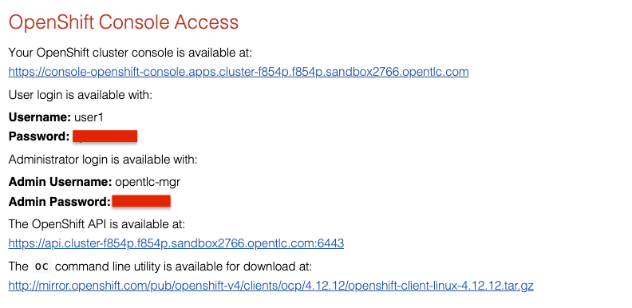

Using the cluster credentials, log into the *OpenShift Console*.

Go to the top-right corner of the page, click *opentlc-mgr* and choose *Copy login command*

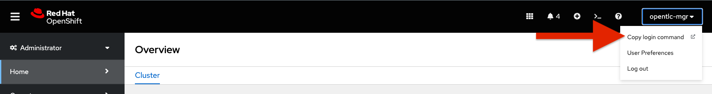

After logging in again, click on *Display Token* to retrieve your *Server URL* and *API Token*. Copy these to a text editor.

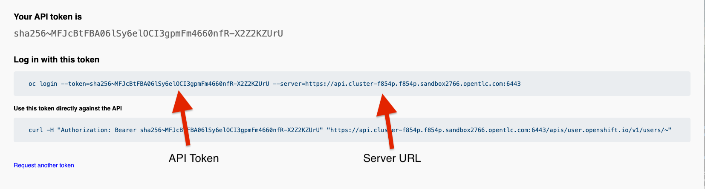

Back on your hub cluster, make sure you are still in *ACM -> Clusters*, and click on *Import Cluster*

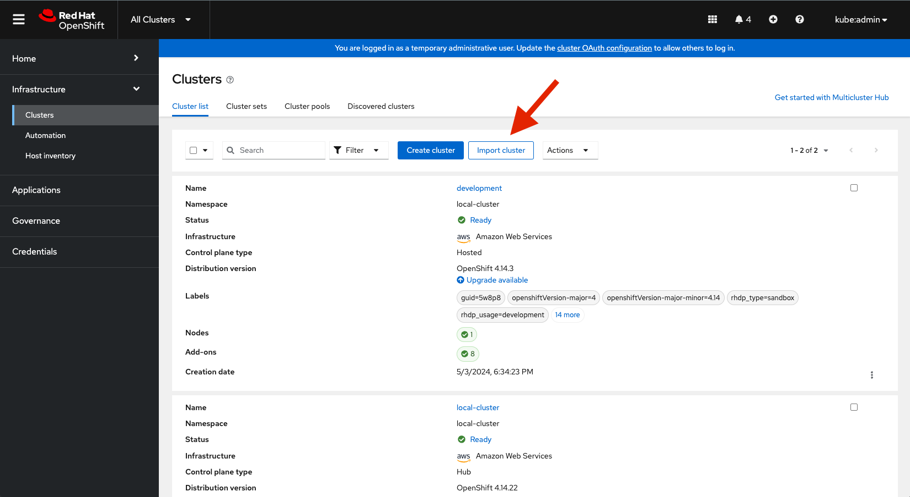

==== Screen 1: Details

* Name:  `production`
* Cluster Set: `default`
* Additional labels: Leave blank for now
* Import mode: "Enter your server URL and API token for the existing cluster"
* Server URL: Enter the *Server URL* from the previous step
* API Token: Enter the *API Token* from the previous step

Click Next

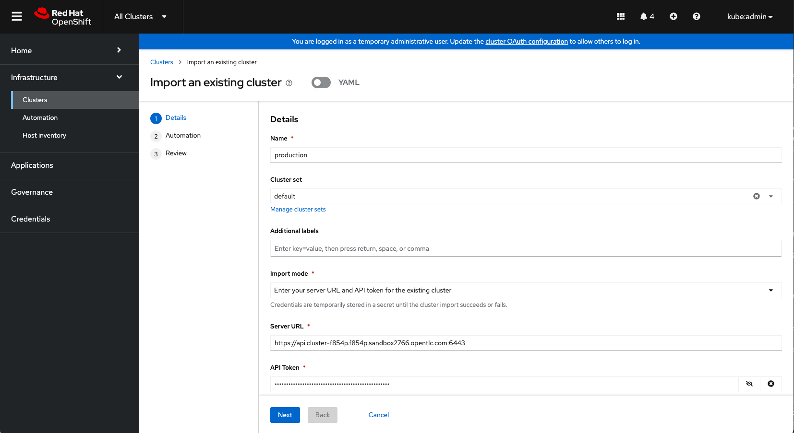

==== Screen 2: Automation

NOTE: Ansible Automation Platform is a powerful tool with deep integrations into ACM. However, we will not cover it in this workshop.

Keep all the defaults.

Click Next

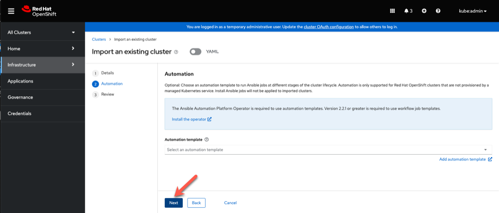

==== Screen 3: Review

You can review the cluster import settings here and even toggle the YAML view to view the CRDs that will be created for you.

Click *Import*. This will start the cluster import process.

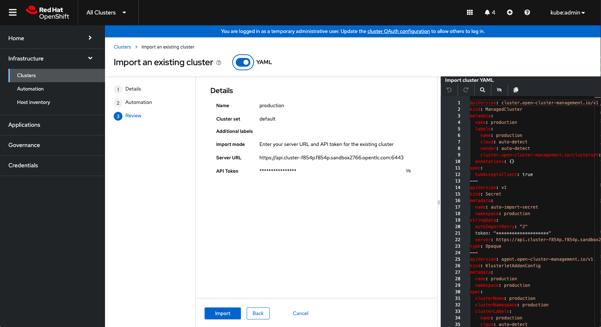

==== Cluster Overview

After clicking *Import*, you will be brought to the Cluster Overview screen.

Feel free to navigate the clusters interface and explore the different day 2 actions you can perform in the cluster. 

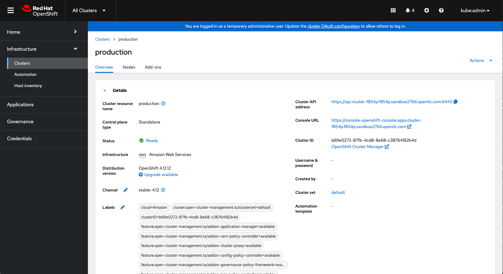

===== *Congratulations!* You have successfully imported a new OpenShift cluster into ACM. Easy, right?

NOTE: If you see a "Cluster is pending import" message on this page, your cluster may not have imported correctly. Click on the *Copy command* button and paste the command into your cluster bastion host.

== Deploying Applications to Clusters

Your environment came pre-loaded with an existing Hosted Control Plane Cluster hosted in AWS called *development*, we will be deploying an application to this cluster.

Application Lifecycle functionality in RHACM provides the processes to manage application resources on your managed clusters. This allows you to define a single or multi-cluster application using Kubernetes specifications but with additional automation of the deployment and lifecycle management of resources to individual clusters. An application designed to run on a single cluster is straightforward and something you ought to be familiar with from working with OpenShift fundamentals. A multi-cluster application allows you to orchestrate deploying these same resources to multiple clusters based on a set of rules you define for which clusters run the application components.

This table describes the different components that the Application Lifecycle model in RHACM is composed of:


|===
|*Resource*|*Purpose*

|Channel|Defines a place where deployable resources are stored, such as an object store, Kubernetes namespace, Helm repository, or GitHub repository.
|Subscription|Definitions that identify deployable resources available in a Channel resource to be deployed to a target cluster.
|Placement or PlacementRule|Defines the target clusters where subscriptions deploy and maintain the application. It comprises Kubernetes resources identified by the Subscription resource and pulled from the location defined in the Channel resource.
|Application|A way to group the components here into a more easily viewable single resource. An Application resource typically references a Subscription resource.
|===


These are all Kubernetes custom resources, defined by a Custom Resource Definition (CRD), created for you when RHACM is installed. By creating these as Kubernetes native objects, you can interact with them the same way you would with a Pod. For instance, running `oc get application` retrieves a list of deployed RHACM applications just as `oc get pods` retrieves a list of deployed Pods.

This may seem like a lot of extra resources to manage besides the deployables that make up your application; however, they enable automating your application's composition, placement, and overall control when deploying to many clusters. With a single cluster, it is easy to log in and run `oc create -f ​.` to create all of your resources. If you need to do that on a dozen clusters, however, you want to ensure you do not make a mistake or miss a cluster and need a way to schedule and orchestrate updates to your applications. Leveraging the Application Lifecycle management tools in RHACM allows you to manage multi-cluster applications easily.

=== Creating an Application

*Prerequisites:*

* Navigate to *Infrastructure → Clusters*
* Click on the *development* Cluster
* Click the *actions dropdown* and select *Edit Labels* button under *Labels* verify the *rhdp_usage=development* label exists in the cluster. If the label doesn't exist create it.

image::images/acm_labels-1.png[]

* Navigate to *Applications*

* Click *Create application, select Subscription*. Enter the following information:
** *Name*: `rocket-chat`
** *Namespace*: `rocket-chat`
** Under repository types, select the *GIT* repository
** *URL:*  https://github.com/levenhagen/rocketchat-acm[https://github.com/levenhagen/rocketchat-acm]
** *Branch*:  `main`
** *Path:*  `rocketchat`

* Verify that *Deploy application resources on clusters with all specified labels* is selected and enter the following information
** *Cluster sets*: `default`
** *Label*: `rhdp_usage`
** *Value*: `development`

* Verify all the information is correct. Click *Create*

It will take a few minutes to deploy the application, *Click* on the *Topology Tab* to view and verify that *all of the circles are green*.

image::images/acm-topology.png[]

Under the topology view, Select the *Route* and click on the *Launch Route* *URL*, this will take you to the Rocket Chat app which is a free-to-use messaging server.

image::images/acm-topology1.png[]

*Congratulations!* You successfully deployed an application to your *development* cluster using RHACM. This approach leveraged a Git repository which housed all of the Kubernetes manifests (YAML) that defined your application. RHACM was able to take those manifests and use them as deployables, which were then deployed to the target cluster based on a label match.

Feel free to experiment with the application and its cluster placement.  How would you move `rocket-chat` to the *production* cluster?

---

=== Extra Credit

If you would like to explore deploying applications via the command line dive into this https://github.com/ultraJeff/rhacm-workshop/tree/master/04.Application-Lifecycle[additional Application Lifecycle tutorial]. *Stop at Preparing RHACM for ArgoCD Integration.* We will be doing this later in the tutorial!

NOTE: You will need to add a new `environment=dev` label to your *development* cluster to deploy the application according to the instructions.

---

== Governance, Risk, and Compliance (Security and compliance use case)

Now that you have a cluster and a deployed application, you must ensure they do not drift from their original configurations. This kind of drift is a serious problem because it can happen from benign and benevolent fixes and changes or malicious activities that you might not notice but can cause significant problems. RHACM's solution to this problem is the Governance, Risk, and Compliance, or GRC, functionality.

=== Review GRC Functionality

Enterprises must meet internal standards for software engineering, secure engineering, resiliency, security, and regulatory compliance for workloads hosted on private, multi and hybrid clouds. Red Hat Advanced Cluster Management for Kubernetes governance provides an extensible policy framework for enterprises to introduce their own security policies.

The governance lifecycle is based on defined policies, processes, and procedures to manage security and compliance from a central interface page. View the following diagram of the governance architecture:

image::images/acm_governance_arch2.x.png[]

Use the Red Hat Advanced Cluster Management for Kubernetes security policy framework to create and manage policies. Kubernetes custom resource definition instances are used to create policies.

Each Red Hat Advanced Cluster Management policy can have at least one or more templates. For more details about the policy elements, view the https://access.redhat.com/documentation/en-us/red_hat_advanced_cluster_management_for_kubernetes/2.10/html-single/governance/index#policy-yaml-table[Policy YAML] table section.


=== Creating Policies in ACM

In order to assist in the creation and management of Red Hat Advanced Cluster Management for Kubernetes policies we use the policy generator tool. This tool, along with GitOps, greatly simplifies the distribution of Kubernetes resource objects to managed OpenShift or Kubernetes clusters through RHACM policies. 

*Prerequisite*

To deploy policies with subscriptions, complete the following steps:

Bind the *open-cluster-management:subscription-admin* ClusterRole to the user creating the subscription, to do this follow this steps:

* Navigate to *Governance Tab*
* On the top tabs, click on *Policies*
* Click *Create Policy* 
* On the top switch the toogle to Display the YAML 

image::images/acm_governance_yaml.png[]

* Copy the following YAML and paste it on the YAML screen 

NOTE: The following YAML creates a policy that checks whether a given cluster contains the open-cluster-management:subscription-admin ClusterRole and associated ClusterRoleBindings exist. This is an example of a Configuration Policy. Other policy types are Certificate and IAM.

[source,YAML,role="copypaste copypaste-warning"]
----
apiVersion: policy.open-cluster-management.io/v1
kind: Policy
metadata:
  name: policy-configure-subscription-admin-hub
  namespace: default
  annotations:
    policy.open-cluster-management.io/standards: NIST SP 800-53
    policy.open-cluster-management.io/categories: CM Configuration Management
    policy.open-cluster-management.io/controls: CM-2 Baseline Configuration
spec:
  remediationAction: inform
  disabled: false
  policy-templates:
    - objectDefinition:
        apiVersion: policy.open-cluster-management.io/v1
        kind: ConfigurationPolicy
        metadata:
          name: policy-configure-subscription-admin-hub
        spec:
          remediationAction: inform
          severity: low
          object-templates:
            - complianceType: musthave
              objectDefinition:
                apiVersion: rbac.authorization.k8s.io/v1
                kind: ClusterRole
                metadata:
                  name: open-cluster-management:subscription-admin
                rules:
                - apiGroups:
                  - app.k8s.io
                  resources:
                  - applications
                  verbs:
                  - '*'
                - apiGroups:
                  - apps.open-cluster-management.io
                  resources:
                  - '*'
                  verbs:
                  - '*'
                - apiGroups:
                  - ""
                  resources:
                  - configmaps
                  - secrets
                  - namespaces
                  verbs:
                  - '*'
            - complianceType: musthave
              objectDefinition:
                apiVersion: rbac.authorization.k8s.io/v1
                kind: ClusterRoleBinding
                metadata:
                  name: open-cluster-management:subscription-admin
                roleRef:
                  apiGroup: rbac.authorization.k8s.io
                  kind: ClusterRole
                  name: open-cluster-management:subscription-admin
                subjects:
                - apiGroup: rbac.authorization.k8s.io
                  kind: User
                  name: kube:admin
                - apiGroup: rbac.authorization.k8s.io
                  kind: User
                  name: system:admin
---
apiVersion: policy.open-cluster-management.io/v1
kind: PlacementBinding
metadata:
  name: binding-policy-configure-subscription-admin-hub
  namespace: default
placementRef:
  name: placement-policy-configure-subscription-admin-hub
  kind: PlacementRule
  apiGroup: apps.open-cluster-management.io
subjects:
- name: policy-configure-subscription-admin-hub
  kind: Policy
  apiGroup: policy.open-cluster-management.io
---
apiVersion: apps.open-cluster-management.io/v1
kind: PlacementRule
metadata:
  name: placement-policy-configure-subscription-admin-hub
  namespace: default
spec:
  clusterConditions:
  - status: "True"
    type: ManagedClusterConditionAvailable
  clusterSelector:
    matchExpressions:
      - {key: name, operator: In, values: ["local-cluster"]}
----

* Click *Next* till the end and then *Submit*

Allow for the policy to propagate to the *local-cluster* (RHACM Hub Cluster).

* Navigate back to *Governance -> Policies* and check the box next to *policy-configure-subscription-admin-hub* policy. 

* Under the *Actions* dropdown, select *Enforce* This will enforce the policy, wait until green checkmark is displayed.

image::images/acm_governance_yaml2.png[]

*Congratulations!* You just enforced your first policy.

=== Using the Policy Generator 

This Policy Generator definition will achieve two configuration policies:

* *openshift-gitops-installed:* The goal of the first one is to inform if the OpenShift GitOps operator is installed on managed clusters.

* *kubeadmin-removed:* The goal of this second policy is to inform if the kubeadmin user is removed from managed clusters.

Both policies are informative only and we will only execute the GitOps Policy manually to showcase how to resolve issues.

In order to deliver these policies we will need to leverage the RHACM Application engine and the GitOps Subcription model.

* Navigate to *Applications*

* Click *Create application, select Subscription*. Enter the following information:
** *Name*: `policy-generator`
** *Namespace*: `policy-generator`
** Under repository types, select the *GIT* repository
** *URL:*  https://github.com/levenhagen/demo-policygenerator[https://github.com/levenhagen/demo-policygenerator.git]
** *Branch*:  `main`
* Verify that *Deploy application resources on clusters with all specified labels* is selected and enter the following information
** *Cluster sets*: `default`
** *Label*: `local-cluster`
** *Value*: `true`
* Verify all the information is correct. Click *Create*

It will take a few minutes to deploy the application, *Click* on the *Topology Tab* to view and verify that *all of the circles are green*.

image::images/acm-topology2.png[]

* Navigate to the *Governance* tab 
* Click on the *Policies* tab
* Verify that you see the two new policies and that there are *Cluster Violations*
** *kubeadmin-removed*
** *openshift-gitops-installed*

image::images/acm-policy.png[]

Now that the policies have been created for us leveraing the Policy Generator Engine let's go ahead and *enforce the GitOps Policy*.

WARNING: *Do not enforce the kubeadmin-removed policy*. You won't be able to access that cluster through the console as the only account created on these clusters is kubeadmin.

* On the *openshift-gitops-installed* policy, click on the elipses and set policy to *Enforce*

image::images/acm-policy2.png[]

* Wait a few minutes and you will see that the *openshift-gitops-installed* cluster violation will go from *red* to *green*

image::images/acm-policy3.png[]

* Click on the Policy and select *Results* to verify that the GitOps operator has been installed.

Now you have succesfully created a Policy leveraging the Policy Generator to scan your clusters. If you would like to play with other policies please visit the https://github.com/stolostron/policy-collection[Policy Repo] for more Policies you can test out.

---

=== Extra Credit
If you would like to run through more policies, including ones in the official https://github.com/stolostron/policy-collection[Policy Repo] and check out templating policies, please continue the tutorial https://github.com/ultraJeff/rhacm-workshop/blob/master/05.Governance-Risk-Compliance/README.md[here]. For even more advanced policies, continue with https://github.com/ultraJeff/rhacm-workshop/tree/master/06.Advanced-Policy-Management#exercise-6---open-policy-agent-gatekeeper[advanced policy management].

Additionally, now that we have OpenShift GitOps installed, if you dove into the additional Application Lifecycle tutorial earlier, you can continue with it from https://github.com/ultraJeff/rhacm-workshop/blob/master/04.Application-Lifecycle/README.md#preparing-rhacm-for-argocd-integration[this point].

---

== End-to-End Visibility (Observability)

In this section, we will put on our Site Reliability Engineer (SRE) hats and set up a dashboard to view multi-cluster system alerts, critical application metrics, and overall system health using ACM's integration with Grafana. Let's walk through the steps now.

You will need:

* Your AWS Keys (from your https://demo.redhat.com/workshop/qmukdd[environment homepage])
* An AWS S3 bucket
* Your workshop bastion host (also from your environment homepage)

=== Create the S3 Bucket

* Log into your bastion host
* Run the following command to log in to AWS:  `aws configure`  and enter your AWS keys when prompted.  Default region: *us-east-2*
* Then, run the following command to create the S3 bucket. (_**Please take note of the bucket name**_)

```bash
aws s3 mb s3://grafana-$GUID
```

=== Integrate Grafana into ACM
* Login to your OpenShift cluster from your bastion host
* Create a namespace for observability by running

```bash
oc create namespace open-cluster-management-observability
```

pmERD-DBbZH-mQdfC-L8Cmb

* Copy the pull secret into this new namespace by running the following two commands

```bash
DOCKER_CONFIG_JSON=`oc extract secret/pull-secret -n openshift-config --to=-`
```

```bash
oc create secret generic multiclusterhub-operator-pull-secret -n open-cluster-management-observability --from-literal=.dockerconfigjson="$DOCKER_CONFIG_JSON" --type=kubernetes.io/dockerconfigjson
```

* In your current folder, create a file called *thanos-object-storage.yaml* and add the following. Please be sure to *update your S3 bucket name and AWS keys*

```yaml
apiVersion: v1
kind: Secret
metadata:
  name: thanos-object-storage
type: Opaque
stringData:
  thanos.yaml: |
    type: s3
    config:
      bucket: YOUR_S3_BUCKET
      endpoint: s3.amazonaws.com
      insecure: false
      access_key: YOUR_ACCESS_KEY
      secret_key: YOUR_SECRET_KEY
```

* Create a secret for your object storage by running the following command

```bash
oc create -f thanos-object-storage.yaml -n open-cluster-management-observability
```

* Create the *MultiClusterObservability* custom resource for your managed clusters. To do this, create a YAML file named *mco_cr.yaml*

```yaml
apiVersion: observability.open-cluster-management.io/v1beta2
kind: MultiClusterObservability
metadata:
  name: observability #Your customized name of MulticlusterObservability CR
spec:
  imagePullPolicy: Always
  observabilityAddonSpec: # The ObservabilityAddonSpec defines the global settings for all managed clusters which have observability add-on enabled
    enableMetrics: true # EnableMetrics indicates the observability addon push metrics to hub server
    interval: 30 # Interval for the observability addon push metrics to hub server
  storageConfig: # Specifies the storage to be used by Observability
    metricObjectStorage:
      name: thanos-object-storage
      key: thanos.yaml
```
NOTE: There are multiple other optional fields to customize this resource. Please check the https://access.redhat.com/documentation/en-us/red_hat_advanced_cluster_management_for_kubernetes/2.7/html/apis/apis#rhacm-docs_apis_multiclusterobservability_jsonmulticlusterobservability[API reference] if you want to change other optional parameters not shown in the YAML above or see more information on observability in the https://access.redhat.com/documentation/en-us/red_hat_advanced_cluster_management_for_kubernetes/2.10/html/observability/enabling-observability-service#enabling-observability[docs].

* Apply the observability YAML to your cluster by running the following command

```bash
oc apply -f mco_cr.yaml
```

* Now navigate to Infrastructure -> Clusters and note the Grafana link in the top right corner of the page.

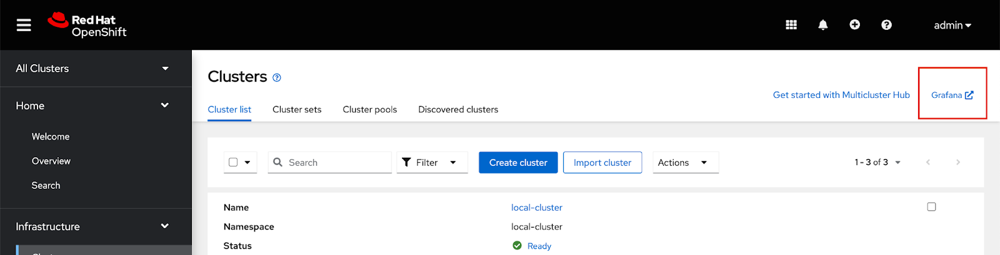

* Click the link and log in using your OpenShift credentials. You will shortly see something like the below

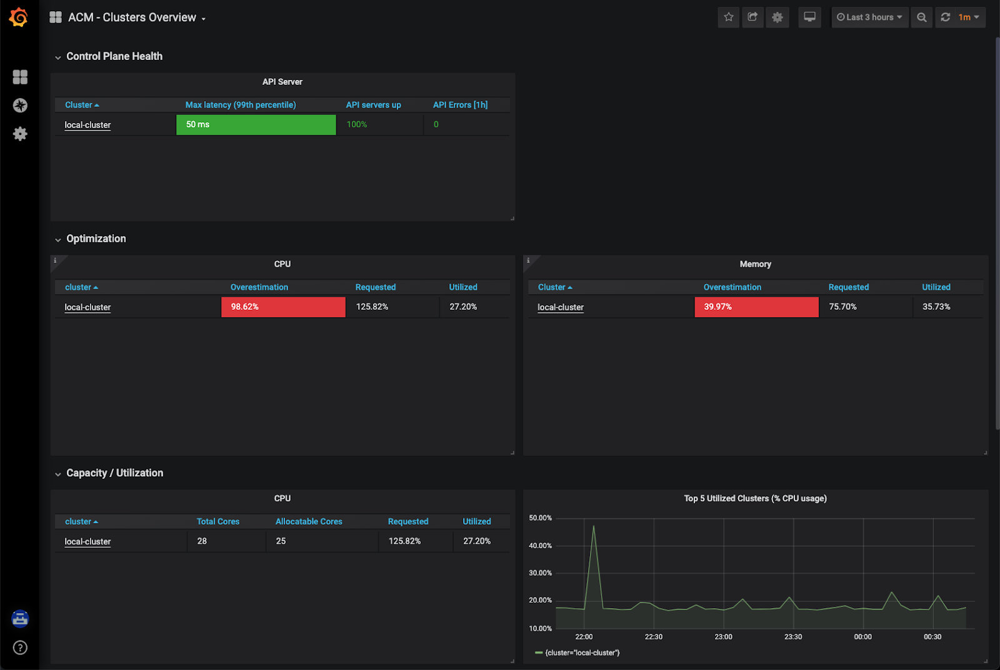

NOTE: It will take a few minutes for the metrics to become visible on the dashboard

=== Explore the default Grafana dashboards

This part focuses on the default Grafana dashboards that come with RHACM. Each dashboard has its own characteristics and provides valuable information to a system administrator in the organization. This section contains multiple tasks that require you to look for certain values in the default dashboards that come with the Multi-Cluster Observability feature.

- Find the maximum latency value for the `local-cluster` API server.
- Find out what % of `local-cluster` memory is utilized.
- Find what is the size of the etcd database in `local-cluster`.
- Find the namespace that consumes the most CPU in `local-cluster`.
- Find which node in `local-cluster` that consumes the most % memory.
- Find what is the `local-cluster` `apiserver` (openshift-apiserver namespace) pod CPU utilization and quota.

=== Creating a custom alert

In this part you will configure custom alerts to monitor your environment. By configuring the alert, you will be able to receive a notification if a rule that you have configured is violated by one of managed clusters in RHACM.

==== Alert #1

The first alert you will configure in the exercise will initiate a notification when a cluster's memory utilization reaches over 20%. In order to create the alert, create the next ConfigMap in the `open-cluster-management-observability` namespace (Make sure to go through the alert before applying it!).

```yaml
apiVersion: v1
data:
  custom_rules.yaml: |
    groups:
      - name: cluster-health
        rules:
        - alert: ClusterMemoryHighUsage
          annotations:
            summary: Notify when memory utilization on a cluster is greater than the defined utilization limit - 20%
            description: "The cluster has a high memory usage: {{ $value }} for {{ $labels.cluster }}."
          expr: |
            1 - sum(:node_memory_MemAvailable_bytes:sum) by (cluster) / sum(kube_node_status_allocatable{resource="memory"}) by (cluster) > 0.2
          for: 5s
          labels:
            cluster: "{{ $labels.cluster }}"
            severity: critical
kind: ConfigMap
metadata:
  name: thanos-ruler-custom-rules
  namespace: open-cluster-management-observability
```

Now that the alert is configured, check whether the alert is initiated or not. To check the alert, navigate to the Grafana instance you've deployed in the previous task. In the Grafana instance, go to the 'Explore' dashboard (compass icon on the left sidebar). Before checking whether the alert is initiated or not, run the alert's query to check the memory utilization in the `local-cluster` cluster. Copy the next expression to the `query` tab, and press `SHIFT + ENTER` to run the query.

```promql
1 - sum(:node_memory_MemAvailable_bytes:sum) by (cluster) / sum(kube_node_status_allocatable{resource="memory"}) by (cluster)
```

The result is a number that identifies the % of memory utilization of a cluster. For example, if the result is `0.1`, the memory utilization of a cluster is `10%`.

Try running the next query -

```
1 - sum(:node_memory_MemAvailable_bytes:sum) by (cluster) / sum(kube_node_status_allocatable{resource="memory"}) by (cluster) > 0.2
```

The query checks whether the result of the previous query is more than `0.2` (20%). If the query checks out, it will present all clusters that utilize more than 20% of their memory - in your case, its only `local-cluster`.

Now that you understand the mechanism behind alerting, try running a query that displays the active alerts in your environment. The query should display the alert that you've configured in the previous steps. Copy the next expression to the `query` tab, and press `SHIFT + ENTER` to run it.

```
ALERTS{alertname="ClusterMemoryHighUsage"}
```

The initiated alert should now appear.

==== Alert #2

The second alert will monitor the etcd database size. An alert will be initiated if the etcd database size in `local-cluster` reaches more than 100MiB. This time, you will create the alert expression by yourself (HINT: you can use the ACM - Clusters Overview dashboard for help).

In order to deploy the second alert to `MCO` add the new alert definition to the `ConfigMap` you have created for the previous alert. The ConfigMap should look like -

```yaml
apiVersion: v1
data:
  custom_rules.yaml: |
    groups:
      - name: cluster-health
        rules:
        - alert: ClusterMemoryHighUsage
          annotations:
            summary: Notify when memory utilization on a cluster is greater than the defined utilization limit - 20%
            description: "The cluster has a high memory usage: {{ $value }} for {{ $labels.cluster }}."
          expr: |
            1 - sum(:node_memory_MemAvailable_bytes:sum) by (cluster) / sum(kube_node_status_allocatable{resource="memory"}) by (cluster) > 0.2
          for: 5s
          labels:
            cluster: "{{ $labels.cluster }}"
            severity: critical
        - alert: ExampleSecondAlert
          annotations:
            summary: Example Summary
            description: "Example description"
          expr: |
            ...
kind: ConfigMap
metadata:
  name: thanos-ruler-custom-rules
  namespace: open-cluster-management-observability
```

Make sure that the alert works as expected.

=== Creating a custom dashboard

In this section you will add your own dashboard to the default dashboards that come with MCO.

Before you can create a custom dashboard, you need to spin up an instance of a "Development Grafana" in which you'll design your dashboard. Follow the steps described in slides 85 and 86 in the [workshop's presentation](https://docs.google.com/presentation/d/1LCPvIT_nF5hwnrfYdlD0Zie4zdDxc0kxZtW3Io5jfFk/edit?usp=sharing) to create the development instance of Grafana.

NOTE: Make sure to log into the Grafana Dev instance with the wanted `admin` user before you run the `./switch-to-grafana-admin.sh` script!


==== Panel #1 - Available memory per node

The dashboard you design in this part will present a graph that aggregates all available nodes in all clusters and show their available memory over a defined time period. In order to configure that dashboard, follow the next steps -

- Log into the development instance.
- Press on the large `+` on the left sidebar, select `Dashboard`.
- A panel will appear in the new dashboard. Press on `Add an empty panel` in order to create a custom graph.
- Enter the next query in the `Metrics browser` tab - `node_memory_MemAvailable_bytes{cluster="local-cluster"}`.
- Enter the next label into the `Legend` field - `{{ instance }}`.
- In the right menu, scroll down to the `Standard options` section. In the `Unit` section, select `Data` -> `bytes (IEC)`.
- In the same menu, add `0` to the `Min` key.
- In the top of the right menu, provide your panel with a name at - `Panel title`.
- Press on `Apply` at the top right end of the screen.
- You have created your first panel!

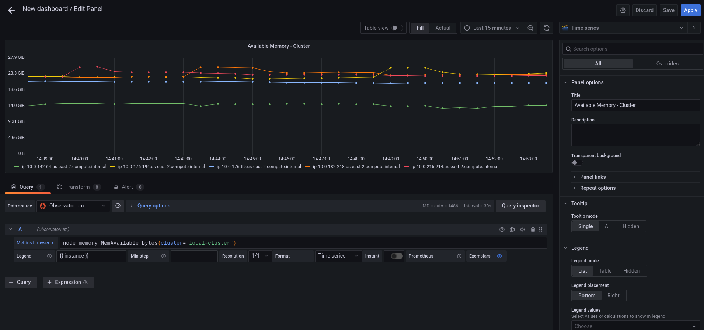

==== Panel #2 - Available CPU per node

For this panel, you will create a same graph like in the previous section, but this time, you will monitor the node's available CPU. While creating the panel, make sure that you use the correct `Units`.

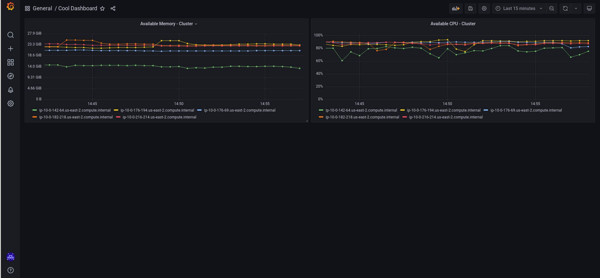

Make sure that you get the correct values by running the next command on the hub cluster -

```bash
<hub> $ oc adm top node
NAME                                         CPU(cores)   CPU%   MEMORY(bytes)   MEMORY%   
ip-10-0-138-131.us-east-2.compute.internal   2064m        27%    10496Mi         34%       
ip-10-0-148-108.us-east-2.compute.internal   3259m        21%    11826Mi         19%       
ip-10-0-166-190.us-east-2.compute.internal   7359m        47%    16188Mi         26%       
ip-10-0-186-66.us-east-2.compute.internal    1786m        23%    8773Mi          28%       
ip-10-0-202-11.us-east-2.compute.internal    1754m        23%    8781Mi          28%  
```

==== Export the dashboard to the main Grafana instance

Until now, you have worked on the "Development" Grafana instance. It's time to export the dashboard you've created to the main "Production" Grafana instance. Before you begin the export process, make sure to save your dashboard by pressing `CTRL + S`. Provide the dashboard with a simple, declarative name.

To export the dashboard to the "Production" instance, follow the steps described in slides 87,88 in the [workshop's presentation](https://docs.google.com/presentation/d/1LCPvIT_nF5hwnrfYdlD0Zie4zdDxc0kxZtW3Io5jfFk/edit?usp=sharing).

Make sure that the dashboard is available in the Production Grafana instance in the 'Custom' directory.

Would you like to do more with Grafana in ACM? Please check out the https://access.redhat.com/documentation/en-us/red_hat_advanced_cluster_management_for_kubernetes/2.10/html/observability/index[Observability] docs to learn more.

---

In summary, we worked with a OpenShift Hosted Control Plane cluster, deploy applications and manage policies all with Red Hat Advanced Cluster Management for Kubernetes, making it much easier to build, manage and secure your Kubernetes Clusters.

*This concludes the Red Hat Advanced Cluster Management lab. Thank you for your time!*

Find out more about https://www.redhat.com/en/technologies/management/advanced-cluster-management[Red Hat Advanced Cluster Management]

